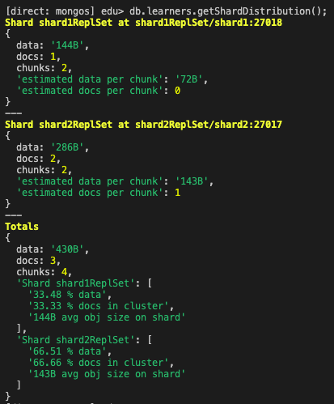
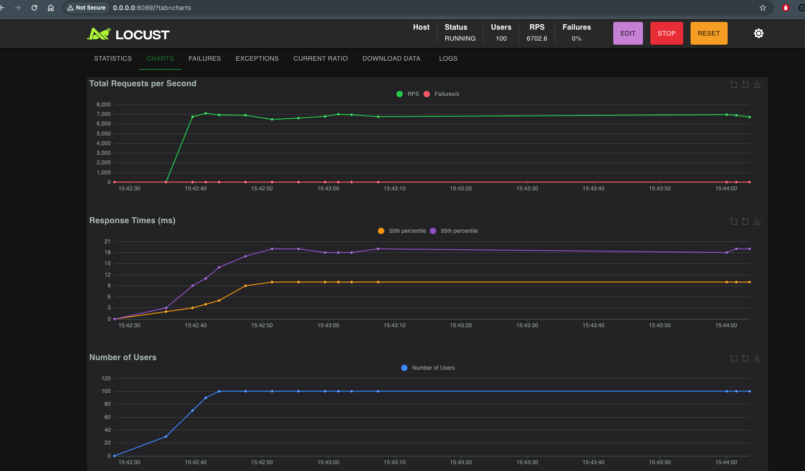
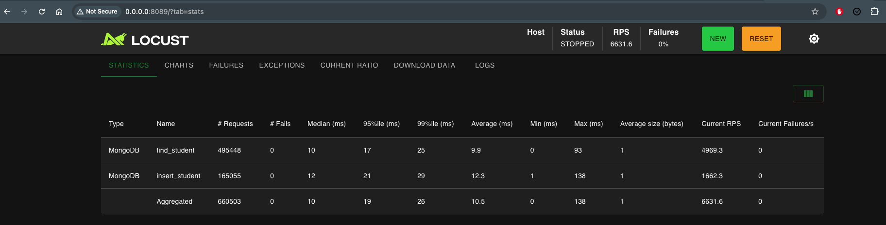
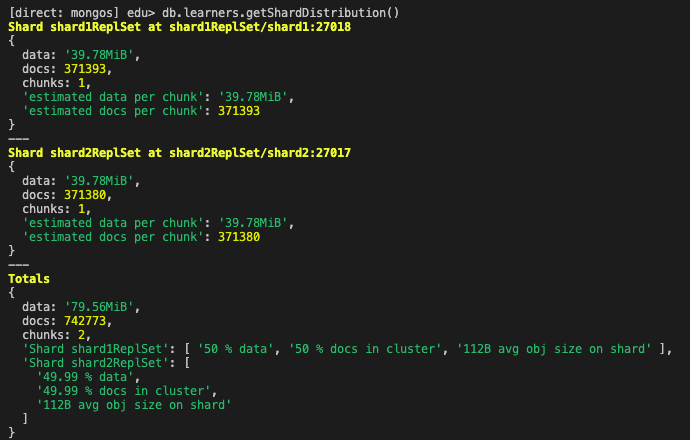

# NoSQL

Итоговое задание по дисциплине Нереляционные базы данных по модулю 3.
Проект подразумевает проектирование схемы базы данных, реализацию распределённой системы, создание клиентского интерфейса
и валидацию производительности под нагрузкой.

Инструменты:
- docker
- mongoDB
- locust
- faker
- pymongo

### Этап 1. Проектирование БД
База данных для анализа и планирования учебного процесса по трем основным группам пользователей: студенты, преподаватели и деканат.

Основные сущности: 
- Learners — студенты
- Tutors — преподаватели
- Subjects — дисциплины
- Groups — учебные группы
- Transcript — оценки
- Semesters — семестры

Диаграмму можно посмотреть по [ссылке](https://app.diagrams.net/?libs=general;uml#G1jLHv-_-vKxa7RPPDHSyJh2t_lvX2Xk_h#%7B%22pageId%22%3A%22C5RBs43oDa-KdzZeNtuy%22%7D) 

В файле edu-schema.js содержится скрипт для развертывания базы данных.

### Этап 2. Реализация шардинга
Создадим контейнеры:
```bash
docker compose up -d
```
Далее инициализируем replica set в shard контейнерах и на конфиг сервере. Сonfig server необходим для хранения метаданных распределения, shard непосредственно хранит данные, а mongos маршрутизирует запросы.

```bash
docker exec -it nosql-configsvr-1 mongosh --port 27019
```
```js
rs.initiate({
  _id: "configReplSet",
  configsvr: true,
  members: [
    { _id: 0, host: "configsvr:27019" }
  ]
})
```

```bash
docker exec -it nosql-shard1-1 mongosh --port 27018
```
```js
rs.initiate({
   _id: "shard1ReplSet",
   members: [
     { _id: 0, host: "shard1:27018" }
   ]
 })
```

```bash
docker exec -it nosql-shard2-1 mongosh
```
```js
rs.initiate({
   _id: "shard2ReplSet",
   members: [
     { _id: 0, host: "shard2:27017" }
   ]
 })
```

Подключимся к mongos
```bash
docker exec -it nosql-mongos-1 mongosh
```
Добавим шарды и включим шардирование для базы данных. Добавим ключи, по которым данные будут распределяться по шардам: learners шардируем по learner_id, transcripts - по составному ключу { learner_id: 1, subject_id: 1 }, так все оценки студента будут храниться в одном шарде. Другие коллекции шардировать не будем, так как они, в отличие от learners и transcripts, содержат значительно меньше данных и редко пополняются.
```js
sh.addShard("shard1ReplSet/shard1:27018")
sh.addShard("shard2ReplSet/shard2:27017")
sh.enableSharding("edu")

sh.shardCollection("edu.learners", { learner_id: "hashed" })
sh.shardCollection(
   "edu.transcript",
   { learner_id: 1, subject_id: 1 }
)
```
Загрузим данные в БД
```bash
mongosh mongodb://localhost:27020 < edu_schema.js
```
И проверим распределение данных



Документы распределились между shard1 и shard2.

### Этап 3. Реализация простого интерфейса
Для удобства работы с данными студентов и добавления оценок реализован простой консольный интерфейс. Доступные действия: добавление нового студента, вывод списка студентов, добавление оценки студенту, вывод оценок студента. Консольный интерфейс можно запустить командой 
```bash
python3 cli.py
```
### Этап 4. Нагрузочное тестирование
Заполним базу фейковыми данными:
```bash
python3 generate_fake_data.py
```
Скрипт создаст 10000 студентов, которые будут распределены поравну между шардами. 
Для проведения нагрузочного тестирования добавлен файл locustfile.py, в котором прописано два сценария чтения и записи данных. 
НТ запускается по команде locust в терминале, после чего на порту 8089 локальной машины откроется интерфейс locust. Я указала в настройках НТ 100 юзеров и 10 users started/second.





По итогу нагрузочного тестирования видим, что данные равномерно распределились по шардам



